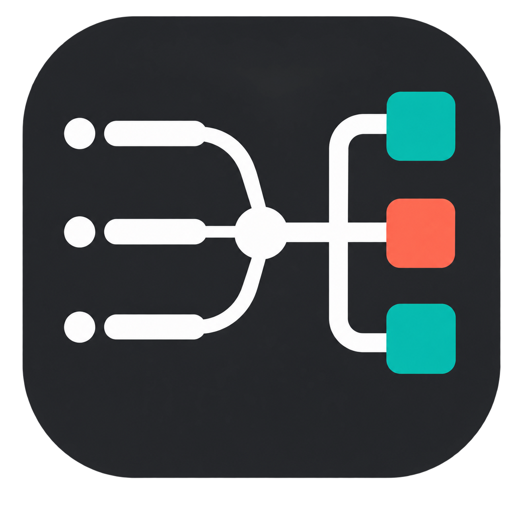
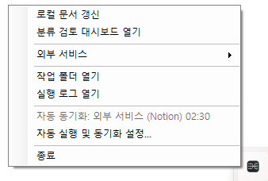
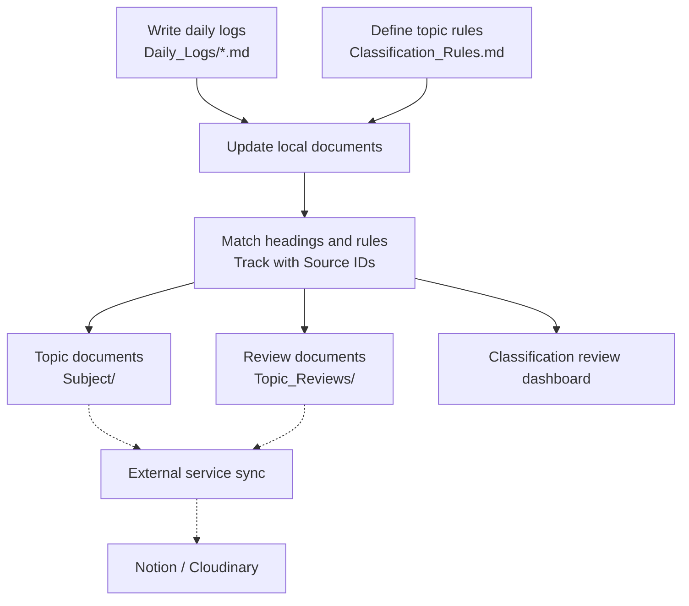

# Log2Topic

**A local-first Markdown research log organizer**

Log2Topic turns daily Markdown notes into topic-based documents using headings and rules you control. Your source notes stay in `Daily_Logs/`, while Log2Topic builds a browsable personal knowledge wiki around them.

[한국어](README.ko.md) · [Quick start](#quick-start) · [Classification rules](Classification_Rules.md) · [Notion integration](docs/NOTION_INTEGRATION.md)

## Quick start

The current distribution supports **Windows 10/11 x64**. Python, Git, and a Notion account are not required. [Obsidian](https://obsidian.md/download) is recommended, but any editor that opens a folder and supports standard Markdown links can be used.

### 1. Prepare the project folder

Place the downloaded project in a writable location such as `Documents\Log2Topic`. Do not run it inside a compressed archive or under `Program Files`.

```text
Log2Topic/
├─ Log2Topic.exe
├─ Classification_Rules.md
├─ Daily_Logs/
├─ attachments/
├─ scripts/
└─ runtime/
```

`Daily_Logs/` and `attachments/` are created on first launch if needed. `Subject/` and `Topic_Reviews/` are created after the first local update.

### 2. Open the Markdown workspace

In Obsidian, choose **Open folder as vault** and select the top-level folder that contains `Log2Topic.exe`. Do not open only `Daily_Logs/`, because generated relative links would no longer resolve correctly.

Use the same top-level folder as the workspace in another Markdown editor.

### 3. Run Log2Topic

1. Double-click `Log2Topic.exe`.
2. On first launch, leaving the automatic task set to `Off` is fine.
3. Find the Log2Topic icon in the Windows notification area. Select `^` if the icon is hidden.

This is the **Log2Topic tray icon**:



Right-click the icon to open the Log2Topic menu. Menu and settings text follow the Windows display language by default. Choose `Automation and sync settings...` to override it with English or Korean; restart Log2Topic after changing the language.

The screenshot below shows the same menu with Korean labels. Its layout is identical when English is selected.



The bundled Python runtime is used automatically, so no Python installation or PATH setup is needed. The executable is not digitally signed yet. If Windows displays a protection warning, verify the filename and download location before deciding whether to run it.

### 4. Create a rule and a daily log

Edit the six-column table in `Classification_Rules.md`. Keep the columns and their order unchanged. Levels 1 through 5 correspond to Markdown headings `#` through `#####`. A matching keyword is not required when the heading name exactly matches the category name.

Create a `.md` file under `Daily_Logs/`:

```markdown
# Projects
## Sample Project
### Testing

This is my first test log.
```

The supplied example can be used for the first run.

### 5. Check the result

1. Right-click the Log2Topic tray icon.
2. Select `Update local documents`.
3. Open `Subject/` and `Topic_Reviews/` after the completion notification.
4. Follow a `Date/Log` link in a generated document back to the source log.

The basic local workflow is now ready. Notion, Cloudinary, and automatic scheduling are optional.

## Core features

- **Local first**: classification and review run on your computer without external transfer
- **Single source**: write only in `Daily_Logs/`; topic documents and reviews are generated
- **Hierarchical classification**: Markdown headings become Level 1 through Level 5 topic paths
- **Rule based**: reproducible results without sending research notes to an AI classifier
- **Source ID tracking**: source and generated documents remain connected after title or path changes
- **Standard Markdown**: works with Obsidian, VS Code, and general Markdown editors
- **Optional integrations**: local features remain independent from Notion and Cloudinary

## How it works

Solid lines are local operations. Dotted lines are optional external integrations.



Do not edit generated files in `Subject/` or `Topic_Reviews/`. Edit the source log or rules, then run the local update again.

## Daily workflow

1. Write headings and content in `Daily_Logs/`.
2. Select `Update local documents` from the tray.
3. Open `Classification review` when an item is unclassified or stops at a parent category.

### Pasting Markdown from an AI service

AI responses may contain headings such as `# Analysis`. Those headings can be mistaken for classification boundaries. Put the whole response inside a blockquote or Obsidian callout below the real classification heading, including `>` on blank lines.

```markdown
### Testing

> [!quote] AI response
> # Analysis
>
> ## Possible cause
> Explanation of the cause.
```

Headings inside the callout are ignored by the classifier. A fenced code block alone is not sufficient.

## Optional external services

Local classification requires no external service configuration.

### Notion

Daily logs, topic documents, and reviews can be synchronized to a Notion database. Configure the Notion internal integration, `Sync Key`, and optional Cloudinary image delivery before running a full sync. Connect only one canonical Markdown workspace to each Notion database.

Setup, image delivery, cleanup safeguards, and recovery procedures are documented in the [Notion integration guide](docs/NOTION_INTEGRATION.md).

## Supported environment

- Official: Windows 10/11 x64
- Recommended editor: Obsidian desktop
- Compatible: editors that support folders and standard relative Markdown links
- Not currently packaged: Windows ARM, macOS, and Linux
- Offline capable: local classification and classification review

## Troubleshooting

- Missing tray icon: check hidden notification icons and `scripts/.runtime/app_error.log`.
- No logs found: confirm the files are under `Daily_Logs/` and end in `.md`.
- `[BUSY]`: wait for the current classification or sync task to finish.
- Notion failure: check `scripts/reports/notion_sync_report.md`.

## Feedback and issues

Use the GitHub `Issues` tab for bugs and feature requests. Do not attach research content or credentials to a public issue. Replace real project names, paths, page IDs, and document content with a minimal fictional example.

## Documentation

- [User guide](docs/USER_GUIDE.md)
- [Classification rules](Classification_Rules.md)
- [Notion integration reference](docs/NOTION_INTEGRATION.md)
- [System reference](docs/SYSTEM_REFERENCE.md)

## License

Distributed under the [MIT License](LICENSE).
