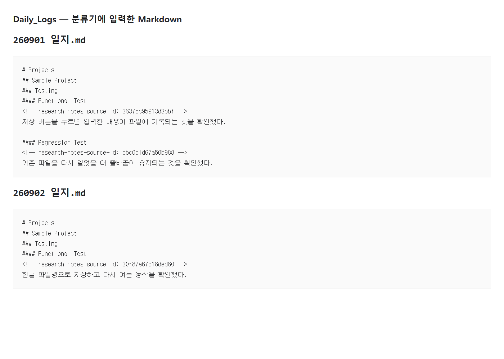
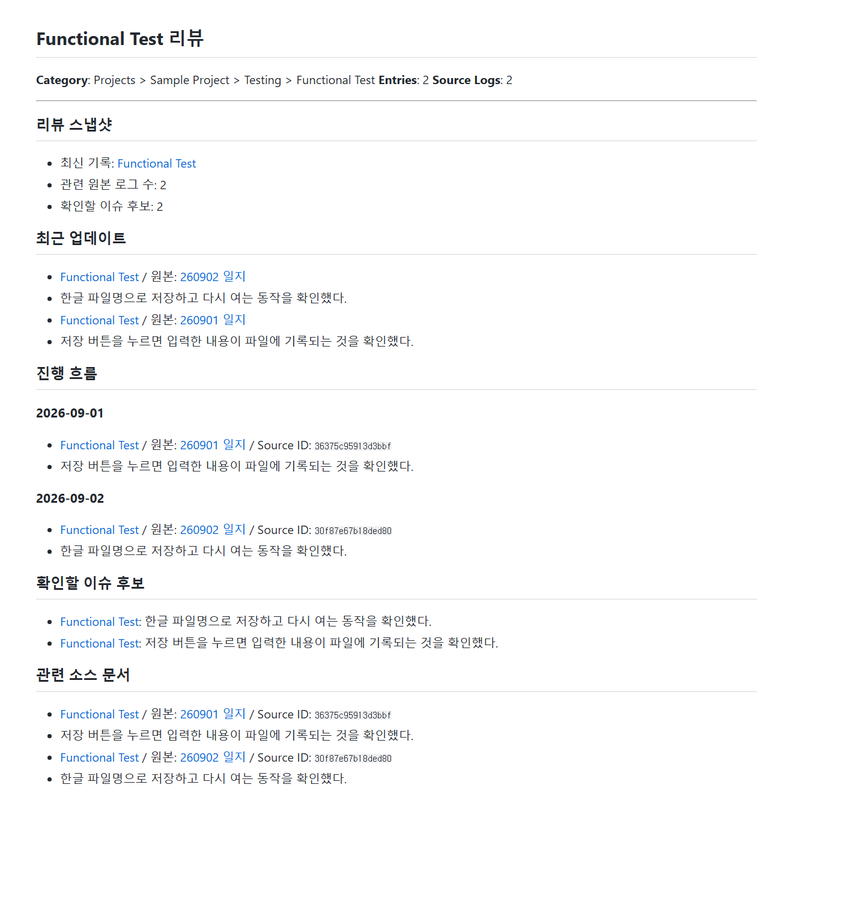
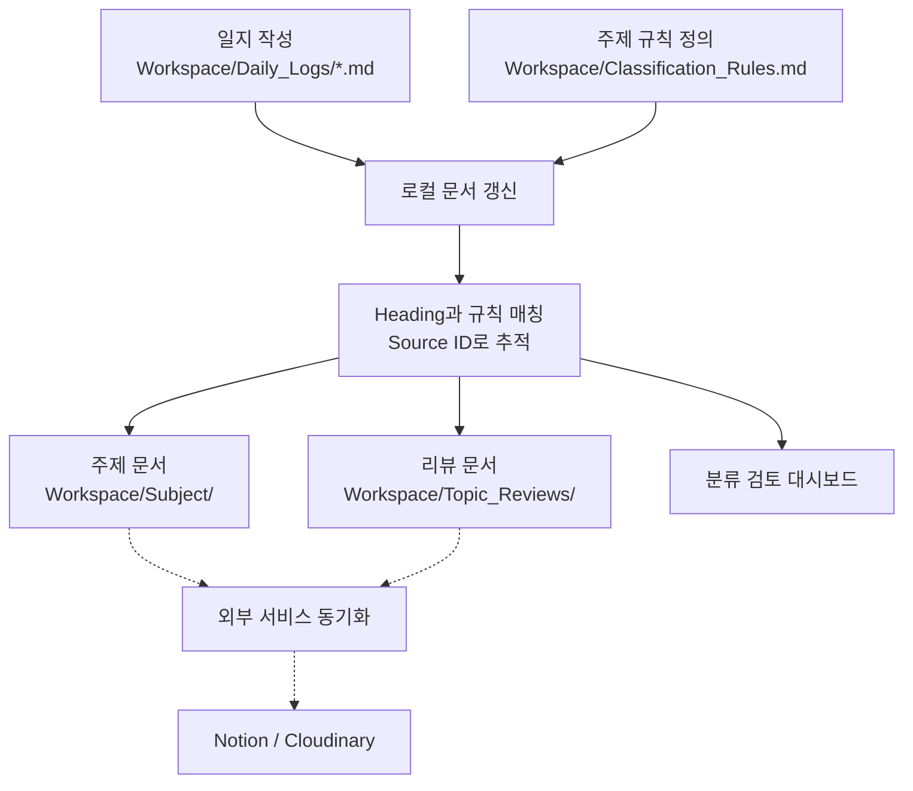

# Log2Topic

**날짜별로 쓰고, 주제별로 다시 읽는 Markdown 기록 도구**

하루의 일지에는 여러 주제의 작업이 섞이고, 하나의 주제는 여러 날짜에 걸쳐 이어집니다. 나중에 특정 주제의 기록을 확인하려면 여러 파일을 열고 필요한 내용을 다시 모아야 합니다.

Log2Topic은 **일지를 한 번 작성하면 주제별 문서와 날짜별 흐름을 보여주는 리뷰를 생성**합니다. 사용자가 정한 Heading과 분류 규칙으로 동작하며, AI나 외부 서비스 없이 로컬에서 사용할 수 있습니다.

[Before / After](#before--after) · [빠른 시작](#처음-시작하기) · [사용자 안내](docs/USER_GUIDE.md) · [분류 규칙](Workspace/Classification_Rules.md)

## Before / After

아래 화면은 가상 일지 두 개를 **실제 분류기로 실행한 입력과 출력**입니다. 개인 기록은 사용하지 않았습니다.

**Before — 원본 일지의 Markdown**



*원본 파일을 브라우저에 표시한 캡처입니다. Source ID 주석은 분류기가 첫 실행에서 자동으로 추가한 것으로, 사용자가 작성할 필요는 없습니다.*

**After — 실제 생성된 Functional Test 리뷰의 읽기 화면**



*생성된 리뷰 파일을 수정 없이 Markdown으로 렌더링해 브라우저에서 캡처했습니다. Log2Topic 전용 편집기 화면이 아니며, 사용하는 Markdown 편집기에 따라 서식은 달라집니다. 이 실행에서 주제 문서 3개와 리뷰 5개가 생성됐으며, 위 화면은 그중 기능 테스트 리뷰입니다.*

다음은 기본 제공 분류 규칙으로 사용할 수 있는 가상 예시입니다. **사용자는 날짜별 일지만 작성하고, 아래의 주제 문서와 리뷰는 Log2Topic이 만듭니다.**

### Before: 날짜별 일지에 여러 작업을 기록합니다

`Workspace/Daily_Logs/260901 일지.md`

```markdown
# Projects
## Sample Project
### Testing
#### Functional Test
저장 버튼을 누르면 입력한 내용이 파일에 기록되는 것을 확인했다.

#### Regression Test
기존 파일을 다시 열었을 때 줄바꿈이 유지되는 것을 확인했다.
```

`Workspace/Daily_Logs/260902 일지.md`

```markdown
# Projects
## Sample Project
### Testing
#### Functional Test
한글 파일명으로 저장하고 다시 여는 동작을 확인했다.
```

이 상태에서 기능 테스트의 흐름을 보려면 두 날짜의 일지를 열고 `Functional Test` 구간을 각각 찾아야 합니다. 회귀 테스트 기록도 첫날 일지에 함께 들어 있습니다.

### 분류: Heading을 주제 경로로 연결합니다

예시의 Heading은 기본 [분류 규칙](Workspace/Classification_Rules.md)에 다음과 같이 연결됩니다.

| 일지의 Heading | 분류 단계 | 만들어지는 주제 경로 |
| :--- | :--- | :--- |
| `# Projects` | Level 1 | Projects |
| `## Sample Project` | Level 2 | Projects → Sample Project |
| `### Testing` | Level 3 | Projects → Sample Project → Testing |
| `#### Functional Test` | Level 4 | Projects → Sample Project → Testing → Functional Test |

일지를 저장한 뒤 트레이 메뉴의 **`로컬 문서 갱신`**을 실행합니다. 자신의 프로젝트에 사용할 때는 분류표의 이름과 일지 Heading을 맞추면 됩니다. 별도의 요약문이나 체크박스는 필요하지 않습니다.

### After: 같은 주제의 기록과 리뷰가 모입니다

아래는 생성 결과 중 테스트 관련 파일만 표시한 구조입니다. 원본 일지는 `Daily_Logs/`에 남습니다.

```text
Workspace/
├─ Daily_Logs/                           ← 사용자가 작성하는 원본
│  ├─ 260901 일지.md
│  └─ 260902 일지.md
├─ Subject/Projects/Sample Project/Testing/
│  ├─ Functional Test/
│  │  ├─ 260901 - Functional Test.md      ← 첫날의 기능 테스트 본문
│  │  └─ 260902 - Functional Test.md      ← 다음 날의 기능 테스트 본문
│  └─ Regression Test/
│     └─ 260901 - Regression Test.md      ← 회귀 테스트 본문
└─ Topic_Reviews/Projects/Sample Project/Testing/
   ├─ [종합 리뷰] Testing.md              ← 하위 주제들을 함께 탐색
   ├─ Functional Test/
   │  └─ [리뷰] Functional Test.md         ← 여러 날짜의 기능 테스트 흐름
   └─ Regression Test/
      └─ [리뷰] Regression Test.md
```

**주제 문서에서는 해당 구간의 본문을 읽습니다.** 예를 들어 `260902 - Functional Test.md`에는 다음 내용과 원본으로 돌아가는 링크, 분류·Source ID 정보가 포함됩니다. 아래는 본문만 발췌한 모습입니다.

> #### Functional Test
> 한글 파일명으로 저장하고 다시 여는 동작을 확인했다.

**리뷰에서는 여러 날짜에 흩어진 기록의 흐름을 한곳에서 확인합니다.** `[리뷰] Functional Test.md`의 ‘진행 흐름’은 다음과 같이 표시됩니다. 링크는 실제 파일에서 각 주제 문서와 원본 일지로 연결되며, 여기서는 표시 형태만 간략히 나타냈습니다.

```text
진행 흐름

2026-09-01
  Functional Test / 원본: 260901 일지
  · 저장 버튼을 누르면 입력한 내용이 파일에 기록되는 것을 확인했다.

2026-09-02
  Functional Test / 원본: 260902 일지
  · 한글 파일명으로 저장하고 다시 여는 동작을 확인했다.
```

현재 리뷰는 원문 앞부분의 짧은 발췌, 날짜별 기록, 하위 리뷰와 출처 링크를 모읍니다. 긴 기록의 결론이나 문제 해결 여부를 자동으로 판단하는 기능은 아닙니다.

| 하고 싶은 일 | 열어볼 위치 |
| :--- | :--- |
| 오늘 작업을 기록하거나 내용을 수정하기 | `Daily_Logs/`의 원본 일지 |
| 특정 주제의 본문만 읽기 | `Subject/`의 주제 문서 |
| 같은 주제의 여러 날짜 기록을 훑어보기 | `Topic_Reviews/`의 리뷰 |
| 여러 하위 주제를 함께 살펴보기 | 상위 폴더의 종합 리뷰 |

원본이나 분류 규칙을 수정한 뒤 다시 갱신하면 생성 결과에도 반영됩니다. `Subject/`와 `Topic_Reviews/`를 따로 편집하거나 일지 내용을 수동으로 복사해 관리할 필요가 없습니다.

## 처음 시작하기

현재 배포본은 **Windows 10/11 x64**용입니다. Python, Git, Notion 계정은 필요하지 않습니다. [Obsidian](https://obsidian.md/download)을 권장하지만 폴더 단위로 파일을 여는 다른 Markdown 편집기도 사용할 수 있습니다.

### 1. 프로젝트 폴더 준비

내려받은 프로젝트를 `문서\Log2Topic`처럼 파일을 수정할 수 있는 일반 폴더에 둡니다. 압축 파일 안이나 `Program Files`에서는 실행하지 마세요.

```text
Log2Topic/
├─ Log2Topic.exe
├─ Workspace/                 # Markdown 편집기에서 이 폴더를 엽니다
│  ├─ Classification_Rules.md
│  ├─ Daily_Logs/
│  └─ attachments/
├─ scripts/
└─ runtime/
```

`Workspace/Daily_Logs/`와 `Workspace/attachments/`가 없으면 첫 실행 때 만들어집니다. `Workspace/Subject/`와 `Workspace/Topic_Reviews/`는 첫 분류 뒤 생성됩니다.

### 2. Markdown 작업공간 열기

Obsidian에서 **폴더를 Vault로 열기**를 선택하고 `Workspace/` 폴더를 지정합니다. 다른 Markdown 편집기에서도 같은 `Workspace/` 폴더를 작업공간으로 여세요. `Daily_Logs/`만 따로 열면 생성 문서의 상대 링크가 올바르게 연결되지 않습니다.

### 3. Log2Topic 실행

1. `Log2Topic.exe`를 더블클릭합니다.
2. 최초 설정에서 자동 작업은 `사용 안 함`으로 저장해도 됩니다.
3. 작업표시줄 알림 영역의 Log2Topic 아이콘을 찾습니다. 보이지 않으면 `^`를 눌러 숨겨진 아이콘을 확인합니다.

알림 영역에서 찾아야 할 **Log2Topic 트레이 아이콘**은 다음과 같습니다.


이 아이콘을 우클릭하면 다음과 같은 메뉴가 표시됩니다.


메뉴와 설정 화면은 기본적으로 Windows 표시 언어를 따릅니다. `자동 실행 및 동기화 설정...`의 언어 항목에서 `System default`, `English`, `한국어` 중 하나를 선택할 수 있으며, 변경한 언어는 Log2Topic을 다시 실행하면 적용됩니다.

프로젝트에 전용 Python 실행 환경이 포함되어 있어 Python 설치나 PATH 설정은 필요하지 않습니다. 실행 파일은 아직 디지털 서명되지 않았으므로 Windows 경고가 나오면 파일 이름과 내려받은 위치를 확인한 뒤 실행 여부를 결정하세요.

### 4. 첫 분류 규칙과 일지 작성

`Workspace/Classification_Rules.md`의 표에 주제 경로를 작성합니다. 표의 여섯 열과 순서는 유지하고, Level 1부터 Level 5를 일지의 `#`부터 `#####` Heading과 맞춥니다. Heading이 분류명과 같으면 매칭 키워드는 비워도 됩니다.

`Workspace/Daily_Logs/`에 `.md` 파일을 만들고 다음처럼 작성합니다.

```markdown
# Projects
## Sample Project
### Testing

첫 번째 테스트 기록입니다.
```

처음에는 기본 제공 예제를 그대로 사용해도 됩니다. 분류표의 빈 셀 상속, 키워드와 경계 규칙은 [Classification_Rules.md](Workspace/Classification_Rules.md)에 설명되어 있습니다.

### 5. 첫 결과 확인

1. 트레이의 Log2Topic 아이콘을 우클릭합니다.
2. `로컬 문서 갱신`을 선택합니다.
3. 완료 후 `Workspace/Subject/`와 `Workspace/Topic_Reviews/`를 확인합니다.
4. 생성 문서의 `Date/Log` 링크로 원본 일지가 열리는지 확인합니다.

여기까지 성공하면 기본 기능을 사용할 준비가 끝난 것입니다. Obsidian 첨부파일 위치, 검토 대시보드와 자동 실행 설정은 [사용자 안내](docs/USER_GUIDE.md)에서 이어서 확인할 수 있습니다.

## 핵심 특징

- **로컬 우선**: 외부 전송 없이 내 컴퓨터에서 분류와 검토
- **단일 원본**: `Workspace/Daily_Logs/`만 작성하고 주제 문서와 리뷰는 자동 생성
- **계층형 분류**: Markdown Heading을 Level 1부터 Level 5까지의 주제 경로로 변환
- **규칙 기반 처리**: AI 분류 없이 동일한 원본과 규칙에 재현 가능한 결과
- **Source ID 추적**: 제목이나 주제 경로가 바뀌어도 원본과 파생 문서 관계 유지
- **표준 Markdown**: Obsidian, VS Code와 일반 Markdown 편집기에서 사용 가능
- **선택적 연동**: 로컬 기능은 독립적으로 유지하고 Notion과 Cloudinary는 필요할 때만 연결

## 동작 흐름

실선은 기본 로컬 동작이고, 점선은 사용자가 설정한 외부 연동입니다.



생성된 `Workspace/Subject/`와 `Workspace/Topic_Reviews/`는 직접 고치지 않습니다. 원본 일지나 분류 규칙을 수정한 뒤 다시 갱신하면 Source ID를 기준으로 기존 결과가 정리됩니다.

## 평소 사용 방법

1. `Workspace/Daily_Logs/`에 Heading과 내용을 작성합니다.
2. 트레이에서 `로컬 문서 갱신`을 실행합니다.
3. 미분류 항목이 있으면 `분류 검토 대시보드 열기`에서 경로를 선택합니다.

### AI 서비스의 Markdown 답변을 넣을 때

AI 답변의 `# 분석 결과` 같은 Heading은 분류 경계로 오인될 수 있습니다. 실제 분류 Heading 아래에서 답변 전체를 인용문 또는 Obsidian 콜아웃으로 넣고, 빈 줄을 포함한 모든 줄 앞에 `>`를 붙이세요.

```markdown
### Testing

> [!quote] AI 서비스 답변
> # 분석 결과
>
> ## 가능한 원인
> 원인에 대한 설명입니다.
```

콜아웃 안의 Heading은 분류에 사용되지 않습니다. 단순히 코드 블록으로 감싸는 것만으로는 충분하지 않습니다. 전체 예제와 Heading을 쓰지 않는 프롬프트는 [사용자 안내](docs/USER_GUIDE.md#ai-서비스의-markdown-답변-붙여넣기)를 참고하세요.

## 선택 사항: 외부 서비스

로컬 분류만 사용할 때는 외부 서비스 설정이 필요하지 않습니다.

### Notion

Notion 데이터베이스로 일지, 주제 문서와 리뷰를 동기화할 수 있습니다. 내부 연결, `Sync Key`, Cloudinary 이미지와 오류 복구 설정은 [Notion 연동 안내](docs/NOTION_INTEGRATION.md)를 순서대로 따라가세요. 하나의 Notion 데이터베이스에는 하나의 기준 Markdown 작업공간만 연결하는 것을 권장합니다.

## 지원 환경

- 공식 지원: Windows 10/11 x64
- 권장 편집기: Obsidian 데스크톱
- 사용 가능: 폴더와 표준 Markdown 상대 링크를 지원하는 편집기
- 현재 미지원: Windows ARM, macOS, Linux 배포본
- 인터넷 없이 사용 가능: 로컬 분류와 검토 대시보드

## 문제가 생겼을 때

- 트레이 아이콘이 없으면 숨겨진 아이콘과 `scripts/.runtime/app_error.log`를 확인합니다.
- 일지를 찾지 못하면 `Workspace/Daily_Logs/` 아래의 파일 확장자가 `.md`인지 확인합니다.
- `[BUSY]`가 나오면 진행 중인 분류나 동기화가 끝난 뒤 다시 실행합니다.
- Notion 오류는 `scripts/reports/notion_sync_report.md`에서 확인합니다.
- Source ID 저장 실패와 업데이트 확인 실패는 [오류별 점검 안내](docs/TROUBLESHOOTING.md)를 참고하세요.

더 많은 점검 순서는 [사용자 안내의 문제 해결](docs/USER_GUIDE.md#문제-해결)을 참고하세요.

## 피드백과 문제 제보

버그와 기능 제안은 이 저장소의 GitHub `Issues` 탭에 남겨주세요. 공개 Issue에는 **연구자료와 인증정보**를 첨부하지 말고, 실제 내용 대신 재현 가능한 가상 예제를 사용하세요. 자세한 작성 기준은 [사용자 안내](docs/USER_GUIDE.md#피드백과-문제-제보)에 있습니다.

## 문서

- [사용자 안내](docs/USER_GUIDE.md): Obsidian 설정, 일상 사용, 검토, 자동 실행과 문제 해결
- [분류 규칙](Workspace/Classification_Rules.md): Level 계층, 상속형 표, 키워드와 경계 규칙
- [Notion 연동](docs/NOTION_INTEGRATION.md): 데이터베이스 연결, 이미지와 동기화 복구
- [시스템 구조](docs/SYSTEM_REFERENCE.md): Source ID, 내부 상태와 유지보수 기준

## 라이선스

이 프로젝트는 [MIT License](LICENSE)로 배포됩니다.
